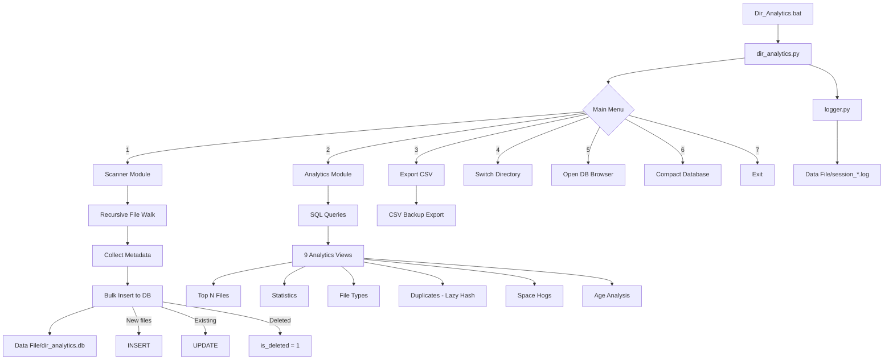

# Code Documentation

Technical reference for the Directory Analytics CLI Tool codebase.

## Architecture Overview



## Folder & File Structure

```
e:\0_Dir_Analytics\
├── Dir_Analytics.bat          # Windows launcher
├── dir_analytics.py           # Main entry point
├── config.py                  # Configuration (multi-directory)
├── database.py                # SQLite operations + lazy hashing
├── scanner.py                 # Fast bulk scanning
├── analytics.py               # SQL-based analytics
├── cli_menu.py                # CLI utilities & tables
├── logger.py                  # Session logging
├── dir_analytics.sql          # SQL query reference
├── README.md                  # User documentation
├── context_readme.md          # Why this tool exists
├── code_readme.md             # Technical documentation
├── CONTRIBUTING.md            # Contribution guidelines
├── LICENSE                    # GNU GPL v3
├── .gitignore                 # Git ignore rules
└── Data File/                 # Created at runtime
    ├── dir_analytics.db       # SQLite database (primary)
    ├── session_*.log          # Session logs
    └── export_*.csv           # CSV backup exports
```

## Module Breakdown

### `config.py` - Configuration
```python
# Key exports:
SCAN_DIRECTORIES = [...]    # List of directories to scan
get_scan_directory()        # Get current active directory
set_scan_directory(index)   # Switch to different directory
DATABASE_PATH               # Path to SQLite database
DB_BROWSER_PATH             # Path to DB Browser for SQLite
```

### `database.py` - SQLite Operations
```python
# Core functions:
init_db()                   # Initialize database schema
get_connection()            # Get SQLite connection
upsert_file(metadata, root) # Insert/update file record
mark_deleted(paths)         # Soft delete files
get_file_count()            # Count active files
export_to_csv()             # Export to CSV
vacuum_database()           # Compact database

# Lazy hashing:
get_size_candidates()       # Find files with same size
compute_hashes_for_candidates()  # Hash potential duplicates
assign_duplicate_groups()   # Group files by hash
get_duplicate_group_stats() # Get duplicate statistics
```

### `scanner.py` - Directory Scanning
```python
# Key functions:
scan_directory(dir)         # Main scan function
get_file_metadata(path)     # Extract file metadata
format_size(bytes)          # Convert bytes to readable
bulk_sync_database(files)   # Bulk insert to database

# Scan flow:
# 1. os.walk() to find all files
# 2. Collect metadata in memory
# 3. Bulk insert/update in single transaction
# 4. Mark deleted files
```

### `analytics.py` - Query Functions
```python
# Available analytics:
get_top_n_files(n)          # Largest files
get_statistics()            # Overall stats
get_type_statistics()       # By extension
find_duplicates()           # Duplicate groups
get_space_hogs(n)           # Largest directories
get_age_analysis()          # Oldest/newest files
get_zero_byte_files()       # Empty files
get_deleted_files()         # Soft-deleted files
get_extension_dominance()   # Extension ranking

# Lazy hashing:
run_duplicate_detection()   # Trigger hash computation
get_potential_duplicate_count()  # Candidates count
```

### `cli_menu.py` - User Interface
```python
# Display functions:
clear_screen()              # Clear terminal
print_header(title)         # Section header
print_menu(title, options)  # Menu display
print_table(headers, rows)  # Tabular data
print_key_value(key, val)   # Key-value pairs
print_banner()              # App banner

# Input functions:
get_user_input(prompt, valid_options)
get_number_input(prompt, default, min, max)
confirm(message)            # Y/N confirmation
pause()                     # Press Enter to continue
```

### `logger.py` - Session Logging
```python
# Logger class that redirects stdout:
start_logging()             # Begin logging session
stop_logging()              # End session
get_log_file()              # Get log file path

# Output format:
# [HH:MM:SS] line content
```

## Database Schema

```sql
CREATE TABLE files (
    id INTEGER PRIMARY KEY AUTOINCREMENT,
    file_name TEXT NOT NULL,
    file_extension TEXT,
    file_size_bytes INTEGER,
    file_size_readable TEXT,
    parent_directory TEXT,
    full_path TEXT UNIQUE,
    scan_root_directory TEXT,      -- Multi-directory support
    created_timestamp TEXT,
    modified_timestamp TEXT,
    file_hash TEXT,                 -- Lazy computed
    duplicate_group INTEGER,        -- Group ID for duplicates
    hash_computed_at TEXT,
    is_deleted INTEGER DEFAULT 0,   -- Soft delete flag
    first_seen TEXT,
    last_seen TEXT,
    deleted_at TEXT
);

-- Indexes for performance:
idx_hash, idx_deleted, idx_extension, 
idx_full_path, idx_size, idx_dup_group, idx_scan_root
```

## Performance Optimizations

### 1. Bulk Database Operations
```python
# Instead of:
for file in files:
    insert(file)
    commit()  # SLOW! ~20ms per commit

# We do:
for file in files:
    insert(file)
commit()  # ONE commit at end
```

### 2. Lazy Hashing
```python
# Only hash files that COULD be duplicates:
candidates = files.group_by(size).having(count > 1)
for file in candidates:
    compute_hash(file)  # Only potential duplicates
```

### 3. Indexed Queries
All frequently-filtered columns have indexes for O(log n) lookups.

## Extending the Tool

### Add a new analytics view:
1. Add query function in `analytics.py`
2. Add menu option in `dir_analytics.py`
3. Create display function using `cli_menu.py` helpers

### Add a new configuration:
1. Add variable in `config.py`
2. Import where needed
3. Document in README

### Add a new database column:
1. Add to `CREATE TABLE` in `database.py`
2. Add `ALTER TABLE` migration for existing DBs
3. Update CSV_COLUMNS in `config.py`
